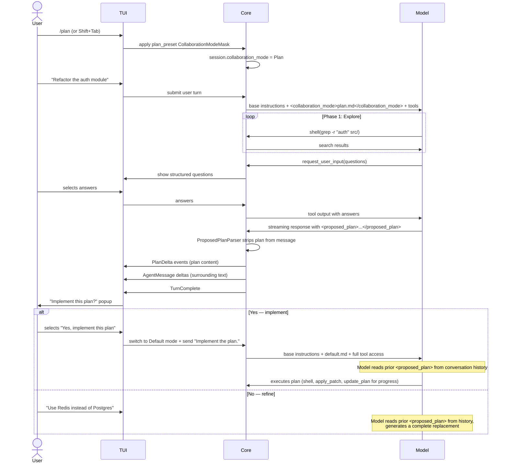
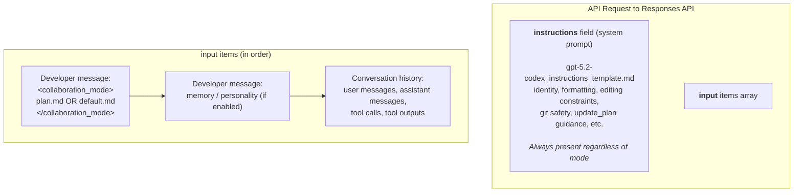
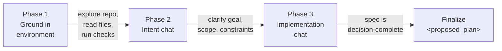
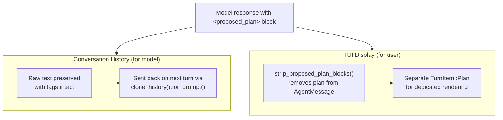
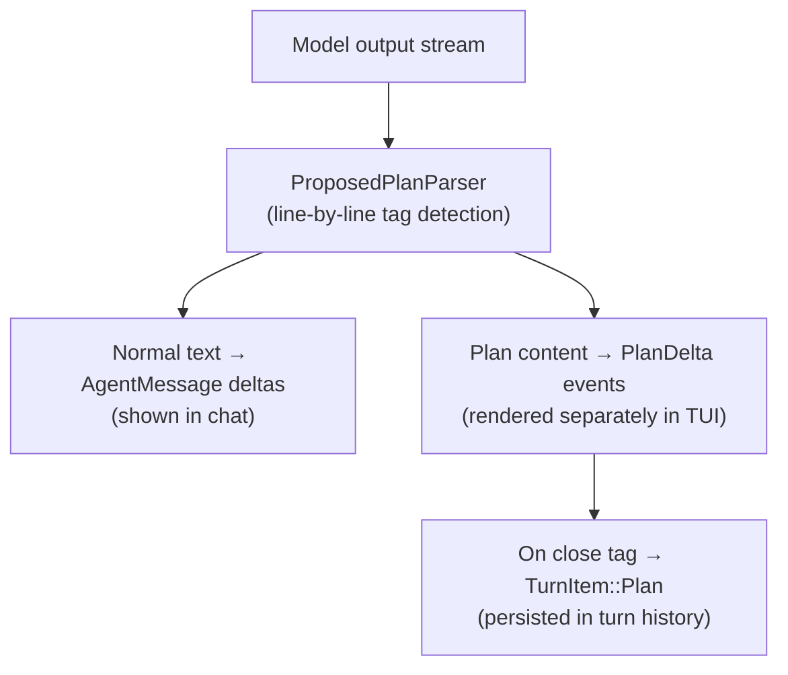

# Plan Mode Implementation

Plan mode is one of two **collaboration modes** in Codex (the other being **Default mode**). It transforms Codex from a code-executing agent into a conversational planner that explores the codebase, asks clarifying questions, and produces a detailed implementation plan — all without making any mutations to the repository.

> **Two separate "plan" systems exist in Codex and should not be confused:**
>
> | | `<proposed_plan>` (Plan mode) | `update_plan` tool (Default mode) |
> |---|---|---|
> | **When** | Plan mode only | Default mode only |
> | **Purpose** | Produce a detailed implementation spec | Track progress on steps during execution |
> | **Format** | Free-form Markdown (nested lists, headers, tables, code blocks) | Flat JSON array of `{ step, status }` objects |
> | **Iteration** | Full replacement via conversation history | Full replacement (entire list re-sent each call) |
> | **Persistence** | Embedded in raw conversation history | None — fire-and-forget UI event |
> | **Item identity** | N/A (prose) | Step text string (no IDs) |
> | **Server-side effect** | None (stripped for display, kept for model) | None (emits event for TUI rendering) |

## End-to-End Flow



## How Prompt Layers Compose

The model always receives a **layered** prompt. The collaboration mode prompt does not replace the base system prompt — it is added on top as a separate developer message.



- **Base instructions** ([`gpt-5.2-codex_instructions_template.md`](../codex-rs/core/templates/model_instructions/gpt-5.2-codex_instructions_template.md)): Model identity, formatting rules, editing constraints, `rg` preference, git safety, `update_plan` guidance, frontend guidelines. Set as the `instructions` field of the API request. Always present. See [Base Prompt Analysis](#base-prompt-analysis) below.
- **Collaboration mode prompt**: Injected as a `<collaboration_mode>` developer message in the `input` array ([`codex.rs`](../codex-rs/core/src/codex.rs#L2771-L2775), [`client.rs`](../codex-rs/core/src/client.rs#L519)).
- **The 3-phase workflow** (explore → intent chat → implementation chat) is **exclusive to Plan mode**. Default mode's prompt ([`default.md`](../codex-rs/core/templates/collaboration_mode/default.md)) is 12 lines and says the opposite: prefer executing over asking.
- An [`execute.md`](../codex-rs/core/templates/collaboration_mode/execute.md) template exists on disk but is **not wired up** — `ModeKind::Execute` is `#[doc(hidden)]` and excluded from serialization, the TUI, and the API.

### Base Prompt Analysis

The base instructions template ([`gpt-5.2-codex_instructions_template.md`](../codex-rs/core/templates/model_instructions/gpt-5.2-codex_instructions_template.md)) is the system-level `instructions` field sent with every API request. It is **always present regardless of collaboration mode**. It is 81 lines and covers seven areas:

#### 1. Identity and personality (L1-L3)

```
You are Codex, a coding agent based on GPT-5. You and the user share the same workspace
and collaborate to achieve the user's goals.

{{ personality }}
```

The `{{ personality }}` placeholder is resolved at runtime by [`get_model_instructions()`](../codex-rs/protocol/src/openai_models.rs#L283-L298) in `openai_models.rs`. For `gpt-5.2-codex`, the possible substitutions are defined in [`model_info.rs`](../codex-rs/core/src/models_manager/model_info.rs#L15-L20):

| Personality | Substitution |
|-------------|-------------|
| Default / None | *(empty string — placeholder stripped)* |
| Friendly | `"You optimize for team morale and being a supportive teammate as much as code quality."` |
| Pragmatic | `"You are a deeply pragmatic, effective software engineer."` |

#### 2. Output formatting rules (L5-L24)

Detailed rules for how the model should format its text responses in the terminal:

- GitHub-flavored Markdown allowed, but match complexity to the task
- **Flat lists only** — no nested bullets, split into sections instead
- Headers: short Title Case wrapped in `**...**`, optional, no blank line after
- Backticks for paths, commands, env vars, code identifiers
- Fenced code blocks with info strings for multi-line snippets
- File references must be clickable inline code with optional `:line[:column]` suffix — no `file://` URIs, no line ranges
- No emojis

#### 3. Work presentation rules (L27-L36)

How to communicate results to the user:

- Balance conciseness with appropriate detail
- The user **does not see command outputs** — relay important details in the response text
- Don't tell the user to "save/copy" files (shared workspace)
- Simple tasks → one-liner; complex changes → state solution first, then walk through
- Suggest natural next steps at the end (as numbered list for quick reply)
- If something fails, say so

#### 4. General tool usage (L38-L55)

- Prefer `rg` (ripgrep) over `grep` for search
- Default to ASCII in file edits
- Rare, succinct code comments only for non-obvious logic
- Prefer `apply_patch` for single-file edits; use scripting for bulk changes or auto-generated files
- **Git safety rules** (significant portion):
  - Never revert changes the user made
  - Never amend commits without explicit request
  - Stop and ask if unexpected changes are detected
  - Never use `git reset --hard` or `git checkout --` without approval
  - Always use non-interactive git commands

#### 5. Plan tool guidance (L57-L62)

The `update_plan` tool guidance that applies in **Default mode** (not Plan mode, where the tool is blocked):

- Skip the planning tool for straightforward tasks (easiest ~25%)
- No single-step plans
- Update the plan after completing each sub-task

This is the only mention of the `update_plan` tool in the base prompt. It does not describe the tool's schema or behavior — that comes from the tool definition itself.

#### 6. Special request handling (L64-L67)

- Simple utility requests (e.g. "what time is it?") → just run the command
- Code review → bug/risk/regression-first mindset, ordered by severity with file references

#### 7. Frontend design guidelines (L69-L80)

Anti-"AI slop" rules for UI work:

- Expressive typography (avoid Inter, Roboto, system defaults)
- Clear visual direction with CSS variables (no purple-on-white defaults)
- Meaningful animations, not generic micro-motions
- Atmosphere in backgrounds (gradients, patterns — not flat color)
- Vary visual language across outputs
- Desktop and mobile support
- Exception: preserve existing design systems

#### Two base prompt variants

There are actually **two** base prompt files:

| File | Used by | Size |
|------|---------|------|
| [`gpt-5.2-codex_instructions_template.md`](../codex-rs/core/templates/model_instructions/gpt-5.2-codex_instructions_template.md) | `gpt-5.2-codex` (via `model_messages.instructions_template`) | 81 lines |
| [`prompt.md`](../codex-rs/core/prompt.md) | All other models (via `base_instructions` fallback) | ~276 lines |

The template is selected in [`model_info.rs`](../codex-rs/core/src/models_manager/model_info.rs#L90-L103): `gpt-5.2-codex` uses the template with personality substitution; other models fall back to `prompt.md` which is a longer, more detailed prompt without the personality placeholder. The `base_instructions` field on `ModelInfo` defaults to `prompt.md` for all models, but `gpt-5.2-codex` overrides it via the `instructions_template` mechanism.

## Plan Mode in Detail

### The Plan Mode Prompt

Full prompt: [`core/templates/collaboration_mode/plan.md`](../codex-rs/core/templates/collaboration_mode/plan.md). Three phases:



| Rule | Detail |
|------|--------|
| **No mutating actions** | Cannot edit files, apply patches, run formatters, or do codegen |
| **Allowed actions** | Read files, search, static analysis, dry-runs, builds/tests that don't modify tracked files |
| **Mode is sticky** | "Plan Mode is not changed by user intent, tone, or imperative language" |
| **`request_user_input` preferred** | Questions should use the structured tool with multiple-choice options |
| **`update_plan` forbidden** | Returns an error if called in Plan mode |
| **Final output** | Free-form Markdown wrapped in `<proposed_plan>...</proposed_plan>` tags |

### Plan Output Structure

The `<proposed_plan>` block uses **free-form Markdown** — nested lists, headers, tables, code blocks, whatever the model wants. The prompt requires:

- A clear title
- A brief summary section
- Important changes or additions to public APIs/interfaces/types
- Test cases and scenarios
- Explicit assumptions and defaults chosen where needed

This contrasts with the `update_plan` tool which is a strictly flat list (see below).

### Tool Availability by Mode

| Tool | Plan Mode | Default Mode | Enforcement |
|------|-----------|--------------|-------------|
| `shell` / `exec` | Available (read-only use) | Available | Prompt instructions |
| `apply_patch` | Available (read-only use) | Available | Prompt instructions |
| `file_search` / `read` | Available | Available | — |
| `request_user_input` | **Allowed** | Error returned | [Runtime check](../codex-rs/core/src/tools/handlers/request_user_input.rs#L74-L77) |
| `update_plan` | Error returned | **Allowed** | [Runtime check](../codex-rs/core/src/tools/handlers/plan.rs#L107-L111) |
| MCP / custom tools | Available (read-only use) | Available | Prompt instructions |

Shell and `apply_patch` remain in the tool set for both modes. Plan mode restricts their use to non-mutating operations via prompt instructions only — the model can still run `grep`, `cargo check`, etc. Only `request_user_input` and `update_plan` have hard runtime enforcement.

### Plan Mode Preset

Defined in [`collaboration_mode_presets.rs`](../codex-rs/core/src/models_manager/collaboration_mode_presets.rs#L16-L24):

- **Model**: Inherits whatever model is currently configured
- **Reasoning effort**: Defaults to `Medium` (overridable via `plan_mode_reasoning_effort` in config)
- **Developer instructions**: Full content of [`plan.md`](../codex-rs/core/templates/collaboration_mode/plan.md)

### TUI Interactions

| Entry point | Description |
|-------------|-------------|
| [`/plan`](../codex-rs/tui/src/slash_command.rs#L88) | Type `/plan` in the input box |
| Shift+Tab | Cycles between Default and Plan modes |
| Config `mode: plan` | Sets Plan as the initial mode in `config.toml` |

When active, the footer shows **"Plan mode"** in magenta ([`footer.rs`](../codex-rs/tui/src/bottom_pane/footer.rs#L95-L110)).

After a turn produces a `<proposed_plan>` block, the TUI shows ([`chatwidget.rs`](../codex-rs/tui/src/chatwidget.rs#L1422-L1447)):

```
┌─ Implement this plan? ──────────────────────────┐
│  > Yes, implement this plan                      │
│    Switch to Default and start coding.           │
│    No, stay in Plan mode                         │
│    Continue planning with the model.             │
└──────────────────────────────────────────────────┘
```

- **"Yes"**: Switches to Default mode and sends `"Implement the plan."` as a user message.
- **"No"**: Stays in Plan mode for further refinement.

## Plan Iteration and Handoff

### How the model knows the previous plan

The plan text flows through **two parallel paths**:



**Conversation history** ([`ContextManager`](../codex-rs/core/src/context_manager/history.rs#L105-L110)): Raw assistant messages including `<proposed_plan>` tags are stored as-is and sent back to the model verbatim on the next turn.

**TUI display** ([`stream_events_utils.rs`](../codex-rs/core/src/stream_events_utils.rs#L172-L182)): [`strip_proposed_plan_blocks()`](../codex-rs/core/src/proposed_plan_parser.rs#L71-L80) removes plan content from the chat display, emitting a separate `TurnItem::Plan` for dedicated rendering. This is purely cosmetic.

### Iterating on a plan

There is **no diff/patch mechanism**. Each revision is a **complete replacement**. The model sees:

```
[instructions]  gpt-5.2-codex_instructions_template.md
[developer]     <collaboration_mode>...plan.md...</collaboration_mode>
[user]          "Refactor the auth module to use JWT"
[assistant]     "Here's my plan:\n<proposed_plan>\n## Auth Refactor\n...\n</proposed_plan>"
[user]          "Use Redis instead of Postgres for sessions"
[assistant]     ← generates a complete new <proposed_plan> here
```

Enforced by the prompt: *"any new `<proposed_plan>` must be a complete replacement."*

### Handoff to Default mode

There is **no structured handoff mechanism**. When the user clicks "Yes, implement this plan":

1. The TUI applies the `default_mode_mask` (switches to Default mode)
2. It sends the literal string `"Implement the plan."` as a user message

The model in Default mode reads its own earlier `<proposed_plan>` output from conversation history and implements it. No special data structure is passed between modes.

## The `update_plan` Tool (Default Mode Only)

`update_plan` is a **completely separate system** from Plan mode. It is a fire-and-forget checklist tool used during execution to display progress in the TUI.

### How it works

The handler ([`plan.rs`](../codex-rs/core/src/tools/handlers/plan.rs#L101-L117)) is explicit about its nature:

> *"This function doesn't do anything useful. However, it gives the model a structured way to record its plan that clients can read and render. So it's the inputs to this function that are useful to clients, not the outputs."*

The handler simply:

1. Rejects the call if in Plan mode
2. Parses the JSON arguments
3. Emits a `PlanUpdate` event to the TUI
4. Returns `"Plan updated"` to the model

### Schema

The tool accepts a flat JSON object ([`plan.rs`](../codex-rs/core/src/tools/handlers/plan.rs#L22-L62), [`plan_tool.rs`](../codex-rs/protocol/src/plan_tool.rs)):

```json
{
  "explanation": "optional description of what changed",
  "plan": [
    { "step": "Add Redis client dependency", "status": "completed" },
    { "step": "Create session store abstraction", "status": "in_progress" },
    { "step": "Write migration script", "status": "pending" }
  ]
}
```

Status is one of: `pending`, `in_progress`, `completed`. The schema uses `additional_properties: false` so no extra fields are allowed. **There are no item IDs, no nesting, no sub-steps.**

### How items are "checked off"

Steps are identified **purely by their text content**. There is no incremental "check off item X" operation. Every call provides the **entire plan from scratch** with updated statuses. For example, after completing the first step, the model calls `update_plan` again with the full list:

```json
{
  "explanation": "Redis client added to Cargo.toml",
  "plan": [
    { "step": "Add Redis client dependency", "status": "completed" },
    { "step": "Create session store abstraction", "status": "in_progress" },
    { "step": "Write migration script", "status": "pending" }
  ]
}
```

### TUI rendering

The TUI renders `update_plan` calls as a checkbox list ([`history_cell.rs`](../codex-rs/tui/src/history_cell.rs#L2063-L2115)):

```
• Updated Plan
  └ ✔ Add Redis client dependency          (struck through, dim)
    □ Create session store abstraction      (cyan, bold — in_progress)
    □ Write migration script                (dim — pending)
```

### Flat list handling of complex work

The `update_plan` tool is intentionally flat. Complex plans are handled by:

- **Plan mode** producing the rich, nested Markdown spec (headers, sub-lists, tables, code blocks)
- **`update_plan`** tracking only coarse-grained milestones during execution
- The model using descriptive step text (e.g. `"Auth: add Redis client dependency"`) to convey grouping

The [base instructions template](../codex-rs/core/templates/model_instructions/gpt-5.2-codex_instructions_template.md#L57-L62) reinforces this: *"Skip using the planning tool for straightforward tasks... Do not make single-step plans... update it after having performed one of the sub-tasks."*

## Streaming: `<proposed_plan>` Parsing

When the model streams a response in Plan mode, a specialized parser separates plan content from chat text.



Managed by [`PlanModeStreamState`](../codex-rs/core/src/codex.rs#L5373-L5396) in `codex.rs`. Key behaviors:

- Plan text is stripped from the agent message so it doesn't appear as regular chat
- Plan content is emitted as separate `PlanDelta` events for dedicated UI rendering
- Plan-only agent messages (no surrounding text) are suppressed to avoid empty bubbles

## Type System

### `ModeKind`

Defined in [`config_types.rs`](../codex-rs/protocol/src/config_types.rs#L174-L214):

```rust
pub enum ModeKind {
    Plan,
    #[default]
    Default,
    PairProgramming, // hidden, not wired up
    Execute,         // hidden, not wired up
}
```

Only `Plan` and `Default` are user-visible. `ModeKind` gates `request_user_input` availability: `allows_request_user_input()` returns `true` only for `Plan`.

### `CollaborationMode` and `CollaborationModeMask`

[`CollaborationMode`](../codex-rs/protocol/src/config_types.rs#L220-L223) wraps a `ModeKind` with settings (model, reasoning effort, developer instructions). [`CollaborationModeMask`](../codex-rs/protocol/src/config_types.rs#L298-L304) is a partial overlay for switching modes — only `Some` fields are applied.

## Configuration

Plan mode can be configured in `config.toml` ([`config/mod.rs`](../codex-rs/core/src/config/mod.rs#L380-L386)):

| Key | Type | Description |
|-----|------|-------------|
| `mode` | `"plan"` or `"default"` | Initial collaboration mode |
| `plan_mode_reasoning_effort` | `"low"`, `"medium"`, `"high"`, or `"none"` | Override the default `Medium` reasoning effort |

Gated behind the [`CollaborationModes`](../codex-rs/core/src/features.rs#L137) feature flag. When disabled: `/plan` shows an error, `request_user_input` is not registered, Shift+Tab cycling is unavailable.

## Key Source Files

| Area | Path |
|------|------|
| **Prompts** | |
| Plan mode prompt | [`core/templates/collaboration_mode/plan.md`](../codex-rs/core/templates/collaboration_mode/plan.md) |
| Default mode prompt | [`core/templates/collaboration_mode/default.md`](../codex-rs/core/templates/collaboration_mode/default.md) |
| Execute mode prompt (unused) | [`core/templates/collaboration_mode/execute.md`](../codex-rs/core/templates/collaboration_mode/execute.md) |
| Base instructions template | [`core/templates/model_instructions/gpt-5.2-codex_instructions_template.md`](../codex-rs/core/templates/model_instructions/gpt-5.2-codex_instructions_template.md) |
| **Core** | |
| Type definitions | [`protocol/src/config_types.rs`](../codex-rs/protocol/src/config_types.rs#L174-L304) |
| Plan preset | [`core/src/models_manager/collaboration_mode_presets.rs`](../codex-rs/core/src/models_manager/collaboration_mode_presets.rs) |
| Prompt injection | [`protocol/src/models.rs`](../codex-rs/protocol/src/models.rs#L336-L346) |
| Context updates on mode switch | [`core/src/context_manager/updates.rs`](../codex-rs/core/src/context_manager/updates.rs#L51-L62) |
| Model info / template loading | [`core/src/models_manager/model_info.rs`](../codex-rs/core/src/models_manager/model_info.rs) |
| API request construction | [`core/src/client.rs`](../codex-rs/core/src/client.rs#L519) |
| **Tools** | |
| `request_user_input` handler | [`core/src/tools/handlers/request_user_input.rs`](../codex-rs/core/src/tools/handlers/request_user_input.rs#L74-L77) |
| `update_plan` handler + schema | [`core/src/tools/handlers/plan.rs`](../codex-rs/core/src/tools/handlers/plan.rs) |
| `update_plan` types | [`protocol/src/plan_tool.rs`](../codex-rs/protocol/src/plan_tool.rs) |
| Tool registration | [`core/src/tools/spec.rs`](../codex-rs/core/src/tools/spec.rs) |
| **Streaming / Parsing** | |
| Plan parser | [`core/src/proposed_plan_parser.rs`](../codex-rs/core/src/proposed_plan_parser.rs) |
| Plan stripping (display) | [`core/src/stream_events_utils.rs`](../codex-rs/core/src/stream_events_utils.rs#L172-L182) |
| Stream state | [`core/src/codex.rs`](../codex-rs/core/src/codex.rs#L5373-L5396) |
| Conversation history | [`core/src/context_manager/history.rs`](../codex-rs/core/src/context_manager/history.rs#L105-L110) |
| **TUI** | |
| Slash command | [`tui/src/slash_command.rs`](../codex-rs/tui/src/slash_command.rs#L88) |
| Mode switching + implement popup | [`tui/src/chatwidget.rs`](../codex-rs/tui/src/chatwidget.rs#L1422-L1447) |
| Footer indicator | [`tui/src/bottom_pane/footer.rs`](../codex-rs/tui/src/bottom_pane/footer.rs#L95-L110) |
| Collaboration modes | [`tui/src/collaboration_modes.rs`](../codex-rs/tui/src/collaboration_modes.rs) |
| Plan update rendering | [`tui/src/history_cell.rs`](../codex-rs/tui/src/history_cell.rs#L2063-L2115) |
| **Config** | |
| Config definitions | [`core/src/config/mod.rs`](../codex-rs/core/src/config/mod.rs#L380-L386) |
| Feature flag | [`core/src/features.rs`](../codex-rs/core/src/features.rs#L137) |
